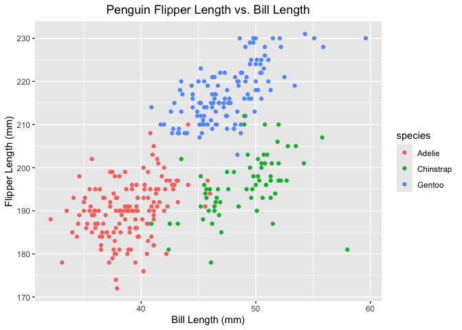

p8105_hw1_daq2107.Rmd
================
Diego A. Quintana Licona (daq2107)
2026-09-23

## Loading necessary libraries for this assignment:

##### what does the descriptions within {} do???

##### ask about RData file…

``` r
library(tidyverse)
```

    ## Warning: package 'readr' was built under R version 4.5.2

    ## ── Attaching core tidyverse packages ──────────────────────── tidyverse 2.0.0 ──
    ## ✔ dplyr     1.2.0     ✔ readr     2.2.0
    ## ✔ forcats   1.0.1     ✔ stringr   1.6.0
    ## ✔ ggplot2   4.0.2     ✔ tibble    3.3.1
    ## ✔ lubridate 1.9.5     ✔ tidyr     1.3.2
    ## ✔ purrr     1.2.1     
    ## ── Conflicts ────────────────────────────────────────── tidyverse_conflicts() ──
    ## ✖ dplyr::filter() masks stats::filter()
    ## ✖ dplyr::lag()    masks stats::lag()
    ## ℹ Use the conflicted package (<http://conflicted.r-lib.org/>) to force all conflicts to become errors

``` r
library(skimr)
```

## Problem 1

Loading ‘penguins’ data set:

``` r
data("penguins", package = "palmerpenguins")
```

After the data has been loaded, we can explore the ‘penguins’ data set:

``` r
penguins #General observation of the data frame
```

    ## # A tibble: 344 × 8
    ##    species island    bill_length_mm bill_depth_mm flipper_length_mm body_mass_g
    ##    <fct>   <fct>              <dbl>         <dbl>             <int>       <int>
    ##  1 Adelie  Torgersen           39.1          18.7               181        3750
    ##  2 Adelie  Torgersen           39.5          17.4               186        3800
    ##  3 Adelie  Torgersen           40.3          18                 195        3250
    ##  4 Adelie  Torgersen           NA            NA                  NA          NA
    ##  5 Adelie  Torgersen           36.7          19.3               193        3450
    ##  6 Adelie  Torgersen           39.3          20.6               190        3650
    ##  7 Adelie  Torgersen           38.9          17.8               181        3625
    ##  8 Adelie  Torgersen           39.2          19.6               195        4675
    ##  9 Adelie  Torgersen           34.1          18.1               193        3475
    ## 10 Adelie  Torgersen           42            20.2               190        4250
    ## # ℹ 334 more rows
    ## # ℹ 2 more variables: sex <fct>, year <int>

``` r
nrow(penguins) #Obtaining number of rows
```

    ## [1] 344

``` r
ncol(penguins) #Obtaining number of columns
```

    ## [1] 8

``` r
skim(penguins$flipper_length_mm) #Using the 'skimr' package to obtain mean flipper length
```

|  |  |
|:---|:---|
| Name | penguins\$flipper_length_m… |
| Number of rows | 344 |
| Number of columns | 1 |
| \_\_\_\_\_\_\_\_\_\_\_\_\_\_\_\_\_\_\_\_\_\_\_ |  |
| Column type frequency: |  |
| numeric | 1 |
| \_\_\_\_\_\_\_\_\_\_\_\_\_\_\_\_\_\_\_\_\_\_\_\_ |  |
| Group variables | None |

Data summary

**Variable type: numeric**

| skim_variable | n_missing | complete_rate |   mean |    sd |  p0 | p25 | p50 | p75 | p100 | hist  |
|:--------------|----------:|--------------:|-------:|------:|----:|----:|----:|----:|-----:|:------|
| data          |         2 |          0.99 | 200.92 | 14.06 | 172 | 190 | 197 | 213 |  231 | ▂▇▃▅▂ |

#### what do we say about ‘important values of variables’?

#### okay to use ‘skmr’ package or do we need to just use mean?

**Description:** We see that the ‘penguins’ data set is a tibble
containing 344 observations and 8 variables, as confirmed by the ‘nrow’
and ‘ncol’ functions (344 rows and 8 columns). Each observation
corresponds to a penguin, whereas the variables describe their location
(‘island’ variable), their species, sex, year of physical
characteristics of each penguin, including their bills’ length and depth
(mm), their flippers’ length (mm), and overall body mass (g).

Additionally, we see that the mean flipper length for all observations
in the data set is 200.9152 mm.

We can also create a scatter plot of flipper length (y) vs. bill length
(x):

``` r
#Using ggplot (part of 'tidyverse' package):

ggplot(penguins, aes(x = bill_length_mm, 
                     y = flipper_length_mm,
                     color = species)) +  #Coloring per 'species' variable
    geom_point() +
  
#Adding labels to my scatter plot (I know this code per previous experience with ggplot)
  
  labs(title = "Penguin Flipper Length vs. Bill Length",
       x = "Bill Length (mm)",
       y = "Flipper Length (mm)") +
  
  theme(plot.title = element_text(hjust = 0.5)) #Centering my title
```

    ## Warning: Removed 2 rows containing missing values or values outside the scale range
    ## (`geom_point()`).

<!-- -->

``` r
#Saving my plot using 'ggsave':

ggsave(filename = "DSI_HW1_Problem1.jpg")
```

    ## Saving 7 x 5 in image

    ## Warning: Removed 2 rows containing missing values or values outside the scale range
    ## (`geom_point()`).

##### jpg or png???

#### do we need to address the missing values???

#### okay extra ggplot things considering my previous class????

#### email reminding him older R version. to Gustavo???

## Problem 2

We can create a data frame using the ‘tibble’ function (part of the
‘tidyverse’ package):

####### do we need to take ‘seed’? to make sure means remain consistent?

``` r
new_df = tibble(
  vec_sample = rnorm(10, mean = 1), #Random sample of 10 and mean equal to 1
  vec_log = vec_sample > 0, #Logical vector checking if the sample's elements are above zero
  vec_char = c("This", "is", "my", "ten", "character", "vector", "with", "great", "joy", "woohoo!"), #Character vector
  vec_factor = factor(c("Mexican", "Japanese", "Japanese", "Mexican", "Lebanese", "Lebanese", "Mexican", "Mexican", "Lebanese", "Japanese")) #Factor vector with three nationality levels
)
```

After we have created our desired data frame, we can attempt to take the
mean of each newly-created variable:

``` r
mean(pull(new_df, vec_sample))
```

    ## [1] 1.267356

``` r
mean(pull(new_df, vec_log))
```

    ## [1] 0.9

``` r
mean(pull(new_df, vec_char))
```

    ## Warning in mean.default(pull(new_df, vec_char)): argument is not numeric or
    ## logical: returning NA

    ## [1] NA

``` r
mean(pull(new_df, vec_factor))
```

    ## Warning in mean.default(pull(new_df, vec_factor)): argument is not numeric or
    ## logical: returning NA

    ## [1] NA

We can see from the output above that we are able to take the mean for
our random sample (mean = 0.7015389) and logical vectors (mean = 0.7).
However, as expected, we cannot take the means of our character and
factor vectors since they are not numerical.

We can attempt to use the ‘as.numeric’ function to convert the variables
into numerical variables and then take the mean:

``` r
as.numeric(new_df$vec_log)
```

    ##  [1] 1 1 0 1 1 1 1 1 1 1

``` r
as.numeric(new_df$vec_char)
```

    ## Warning: NAs introduced by coercion

    ##  [1] NA NA NA NA NA NA NA NA NA NA

``` r
as.numeric(new_df$vec_factor)
```

    ##  [1] 3 1 1 3 2 2 3 3 2 1

``` r
mean(pull(new_df, vec_log))
```

    ## [1] 0.9

``` r
mean(pull(new_df, vec_char))
```

    ## Warning in mean.default(pull(new_df, vec_char)): argument is not numeric or
    ## logical: returning NA

    ## [1] NA

``` r
mean(pull(new_df, vec_factor))
```

    ## Warning in mean.default(pull(new_df, vec_factor)): argument is not numeric or
    ## logical: returning NA

    ## [1] NA

####### Need office hours with this one
